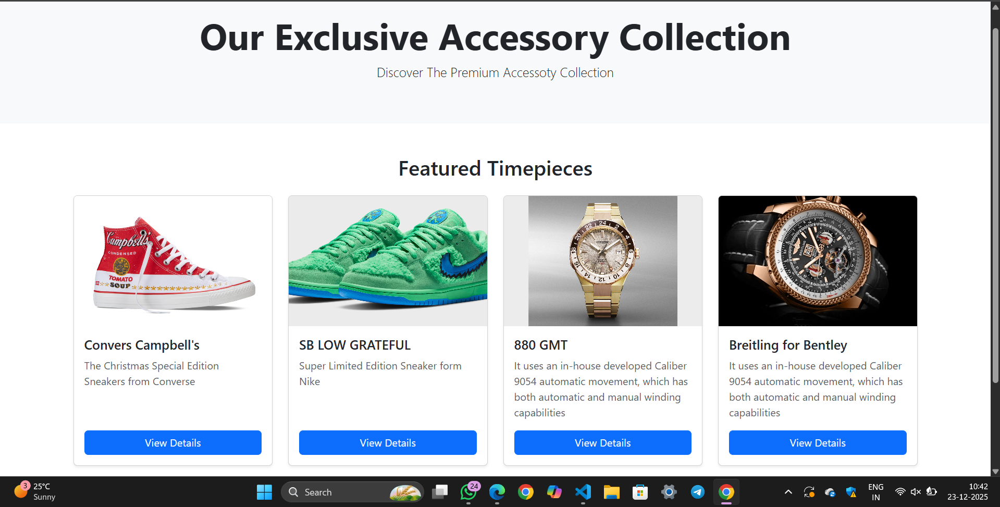

# Project Responsive Web Design using Bootstrap
# Date:19/12/2025
# AIM:
To create a simplified clone of Dribbble (https://dribbble.com/) landing page.

# DESIGN STEPS:
## Step 1:
Clone the repository from GitHub.

## Step 2:
Create Django Admin project.

## Step 3:
Create a New App under the Django Admin project.

## Step 4:
Insert the necessary CSS and JavaScript files as external in order to use Bootstrap.

## Step 5:
Create a HTML file and include the needed Bootstrap components.

## Step 6:
Publish the website in the LocalHost.

# PROGRAM :
```
<!DOCTYPE html>
<html lang="en">
<head>
    <meta charset="UTF-8">
    <meta name="viewport" content="width=device-width, initial-scale=1.0">
    <title>Watch Collection</title>
    <link href="https://cdn.jsdelivr.net/npm/bootstrap@5.3.3/dist/css/bootstrap.min.css" rel="stylesheet">
    <link rel="stylesheet" href="https://cdn.jsdelivr.net/npm/bootstrap-icons@1.11.3/font/bootstrap-icons.css">
    <style>
        
        .watch-card-img {
            height: 200px; 
            object-fit: cover;
        }
    </style>
</head>
<body>

    <header class="bg-light text-center py-5">
        <div class="container">
            <h1 class="display-4 fw-bold">Our Exclusive Accessory Collection</h1>
            <p class="lead">Discover The Premium Accessoty Collection</p>
        </div>
    </header>

    <section class="py-5">
        <div class="container">
            <h2 class="text-center mb-4">Featured Timepieces</h2>
            <div class="row row-cols-1 row-cols-sm-2 row-cols-md-3 row-cols-lg-4 g-4">
                
                <div class="col">
                    <div class="card shadow-sm h-100">
                        
                        <div class="card-body d-flex flex-column">
                            <h5 class="card-title">Convers Campbell's</h5>
                            <p class="card-text text-muted">The Christmas Special Edition Sneakers from Converse</p>
                            <a href="#" class="btn btn-primary mt-auto">View Details</a>
                        </div>
                    </div>
                </div>

                <div class="col">
                    <div class="card shadow-sm h-100">
                        
                        <div class="card-body d-flex flex-column">
                            <h5 class="card-title">SB LOW GRATEFUL</h5>
                            <p class="card-text text-muted">Super Limited Edition Sneaker form Nike</p>
                            <a href="#" class="btn btn-primary mt-auto">View Details</a>
                        </div>
                    </div>
                </div>

                <div class="col">
                    <div class="card shadow-sm h-100">
                        
                        <div class="card-body d-flex flex-column">
                            <h5 class="card-title">880 GMT</h5>
                            <p class="card-text text-muted">It uses an in-house developed Caliber 9054 automatic movement, which has both automatic and manual winding capabilities</p>
                            <a href="#" class="btn btn-primary mt-auto">View Details</a>
                        </div>
                    </div>
                </div>

                <div class="col">
                    <div class="card shadow-sm h-100">
                        
                        <div class="card-body d-flex flex-column">
                            <h5 class="card-title">Breitling for Bentley</h5>
                            <p class="card-text text-muted">It uses an in-house developed Caliber 9054 automatic movement, which has both automatic and manual winding capabilities</p>
                            <a href="#" class="btn btn-primary mt-auto">View Details</a>
                        </div>
                    </div>
                </div>
                
                </div>
        </div>
    </section>
```
# OUTPUT:

# RESULT:
The Project for responsive web design using Bootstrap is completed successfully.
